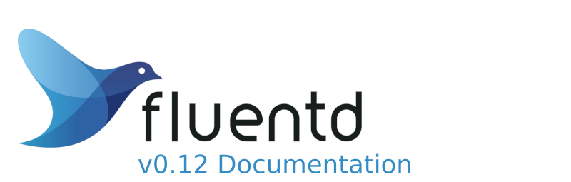

# Introduction

[Fluentd](https://www.fluentd.org/) is an open source data collector for unified logging layer. Fluentd allows you to unify data collection and consumption for a better use and understanding of data.

**The development/support of Fluentd v0.12 has been ended. We don't recommend to use v0.12 for the deployment. Use v1 for new deployment**

[Fluentd](https://www.fluentd.org/) is licensed under the terms of the [Apache License v2.0](http://www.apache.org/licenses/LICENSE-2.0). This project is made and sponsored by [Treasure Data](https://www.treasuredata.com).

