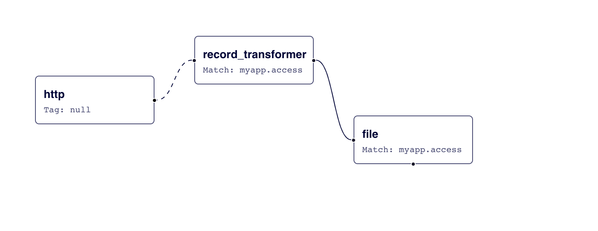
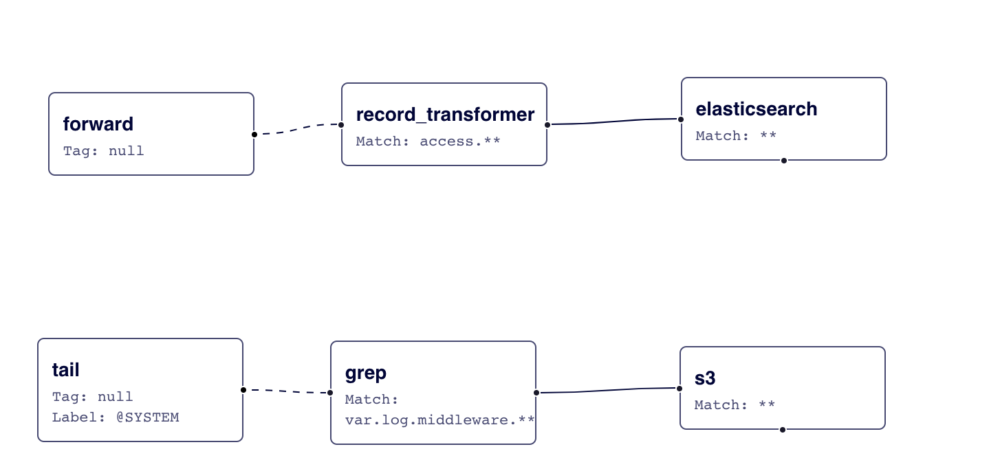

# Config File Syntax

This article describes the basic concepts of Fluentd configuration file syntax.

## Introduction: The Lifecycle of a Fluentd Event

Here is a brief overview of the lifecycle of a Fluentd event to help you understand the rest of this page:

The configuration file allows the user to control the input and output behavior of Fluentd by 1\) selecting input and output plugins; and, 2\) specifying the plugin parameters. The file is required for Fluentd to operate properly.

See also: [Lifecycle of a Fluentd Event](../quickstart/life-of-a-fluentd-event.md)

## Config File Location

#### RPM, Deb or DMG

If you install Fluentd using the `td-agent` packages, the config file should be at `/etc/td-agent/td-agent.conf`.

```text
$ sudo vi /etc/td-agent/td-agent.conf
```

#### Gem

If you install Fluentd using the Ruby Gem, you can create the configuration file using the following commands:

```text
$ sudo fluentd --setup /etc/fluent
$ sudo vi /etc/fluent/fluent.conf
```

Sending a `SIGHUP` signal will reload the config file.

### Docker

For a Docker container, the default location of the config file is `/fluentd/etc/fluent.conf`. To mount a config file from outside of Docker, use a `bind-mount`.

```text
docker run -ti --rm -v /path/to/dir:/fluentd/etc fluentd -c /fluentd/etc/<conf-file>
```

#### `FLUENT_CONF` Environment Variable

You can change the default configuration file location via `FLUENT_CONF`. For example, `/etc/td-agent/td-agent.conf` is specified via `FLUENT_CONF` inside `td-agent` scripts.

#### `-c` option

See [Command Line Option](../deployment/command-line-option.md) article.

## Character Encoding

Fluentd assumes configuration file is `UTF-8` or `ASCII`.

## List of Directives

The configuration file consists of the following directives:

1. **`source`** directives determine the input sources
2. **`match`** directives determine the output destinations
3. **`filter`** directives determine the event processing pipelines
4. **`system`** directives set system-wide configuration
5. **`label`** directives group the output and filter for internal routing
6. **`worker`** directives limit to the specific workers
7. **`@include`** directives include other files

Let's actually create a configuration file step by step.

## 1. `source`: where all the data comes from

Fluentd input sources are enabled by selecting and configuring the desired input plugins using **source** directives. Fluentd standard input plugins include `http` and `forward`. The `http` provides an HTTP endpoint to accept incoming HTTP messages whereas `forward` provides a TCP endpoint to accept TCP packets. Of course, it can be both at the same time. You may add multiple `source` configurations as required.

```text
# Receive events from 24224/tcp
# This is used by log forwarding and the fluent-cat command
<source>
  @type forward
  port 24224
</source>

# http://<ip>:9880/myapp.access?json={"event":"data"}
<source>
  @type http
  port 9880
</source>
```

Each **source** directive must include a `@type` parameter to specify the input plugin to use.

#### Interlude: Routing

The `source` submits events to the Fluentd routing engine. An event consists of three entities: **tag**, **time** and **record**. The `tag` is a string separated by dots \(e.g. `myapp.access`\), and is used as the directions for Fluentd internal routing engine. The `time` field is specified by input plugins, and it must be in the Unix time format. The `record` is a JSON object.

Fluentd accepts all non-period characters as a part of a `tag`. However, since the `tag` is sometimes used in a different context by output destinations \(e.g. the table name, database name, key name, etc.\), **it is strongly recommended that you stick to the lower-case alphabets, digits and underscore** \(e.g. `^[a-z0-9_]+$`\).

In the previous example, the HTTP input plugin submits the following event:

```text
# generated by http://<ip>:9880/myapp.access?json={"event":"data"}
tag: myapp.access
time: (current time)
record: {"event":"data"}
```

#### Didn't find your input source? You can write your own plugin!

You can add new input sources by writing your own plugins. For further information regarding Fluentd input sources, please refer to the [Input Plugin Overview](../input/) article.

## 2. "match": Tell fluentd what to do!

The **match** directive looks for events with **match**ing tags and processes them. The most common use of the `match` directive is to output events to other systems. For this reason, the plugins that correspond to the `match` directive are called **output plugins**. Fluentd standard output plugins include `file` and `forward`. Let's add those to our configuration file.

```text
# Receive events from 24224/tcp
# This is used by log forwarding and the fluent-cat command
<source>
  @type forward
  port 24224
</source>

# http://<ip>:9880/myapp.access?json={"event":"data"}
<source>
  @type http
  port 9880
</source>

# Match events tagged with "myapp.access" and
# store them to /var/log/fluent/access.%Y-%m-%d
# Of course, you can control how you partition your data
# with the time_slice_format option.
<match myapp.access>
  @type file
  path /var/log/fluent/access
</match>
```

Each `match` directive must include a match pattern and a `@type` parameter. Only events with a `tag` matching the pattern will be sent to the output destination \(in the above example, only the events with the tag `myapp.access` are matched. See [the section below for more advanced usage](config-file.md#how-do-the-match-patterns-work)\). The `@type` parameter specifies the output plugin to use.

Just like input sources, you can add new output destinations by writing custom plugins. For further information regarding Fluentd output destinations, please refer to the [Output Plugin Overview](../output/) article.

## 3. "filter": Event processing pipeline

The **filter** directive has the same syntax as `match` but `filter` could be chained for processing pipeline. Using filters, event flow is like this:

```text
Input -> filter 1 -> ... -> filter N -> Output
```

Let's add standard `record_transformer` filter to `match` example.

```text
# http://this.host:9880/myapp.access?json={"event":"data"}
<source>
  @type http
  port 9880
</source>

<filter myapp.access>
  @type record_transformer
  <record>
    host_param "#{Socket.gethostname}"
  </record>
</filter>

<match myapp.access>
  @type file
  path /var/log/fluent/access
</match>
```

Visualization of configuration: [https://link.calyptia.com/6mk](https://link.calyptia.com/6mk) \(sign-up required\)



The received event `{"event":"data"}` goes to `record_transformer` filter first. The `record_transformer` filter adds `host_param` field to the event; and, then the filtered event `{"event":"data","host_param":"webserver1"}` goes to the `file` output plugin.

You can also add new filters by writing your own plugins. For further information regarding Fluentd filter destinations, please refer to the [Filter Plugin Overview](../filter/) article.

## 4. Set system-wide configuration: the `system` directive

System-wide configurations are set by `system` directive. Most of them are also available via command line options. For example, the following configurations are available:

* `log_level`
* `suppress_repeated_stacktrace`
* `emit_error_log_interval`
* `suppress_config_dump`
* `without_source`
* `process_name` \(Only available in `system` directive. No fluentd option\)

Example:

```text
<system>
  # equal to -qq option
  log_level error
  # equal to --without-source option
  without_source
  # ...
</system>
```

See also [System Configuration](../deployment/system-config.md) article for more detail.

### `process_name`

If this parameter is set, fluentd supervisor and worker process names are changed.

```text
<system>
  process_name fluentd1
</system>
```

With this configuration, `ps` command shows the following result:

```text
% ps aux | grep fluentd1
foo      45673   0.4  0.2  2523252  38620 s001  S+    7:04AM   0:00.44 worker:fluentd1
foo      45647   0.0  0.1  2481260  23700 s001  S+    7:04AM   0:00.40 supervisor:fluentd1
```

This feature requires Ruby 2.1 or later.

## 5. Group filter and output: the "label" directive

The **label** directive groups filter and output for internal routing. The `label` reduces the complexity of `tag` handling.

The `label` parameter is a builtin plugin parameter so `@` prefix is needed.

Here is a configuration example:

```text
<source>
  @type forward
</source>

<source>
  @type tail
  @label @SYSTEM
</source>

<filter access.**>
  @type record_transformer
  <record>
    # ...
  </record>
</filter>
<match **>
  @type elasticsearch
  # ...
</match>

<label @SYSTEM>
  <filter var.log.middleware.**>
    @type grep
    # ...
  </filter>
  <match **>
    @type s3
    # ...
  </match>
</label>
```

Visualization of configuration: [https://link.calyptia.com/dxn](https://link.calyptia.com/dxn) \(sign-up required\)



In this configuration, `forward` events are routed to `record_transformer` filter / `elasticsearch` output and `in_tail` events are routed to `grep` filter / `s3` output inside `@SYSTEM` label.

The `label` parameter is useful for event flow separation without the `tag` prefix.

### `@ERROR` label

The `@ERROR` label is a builtin label used for error record emitted by plugin's `emit_error_event` API.

If `<label @ERROR>` is set, the events are routed to this label when the related errors are emitted e.g. the buffer is full or the record is invalid.

### `@ROOT` label

The `@ROOT` label is a builtin label used for getting root router by plugin's `event_emitter_router` API.

This label is introduced since v1.14.0 to assign a label back to the default route. For example, timed-out event records are handled by the concat filter can be sent to the default route.

## 6. Limit to specific workers: the `worker` directive

When setting up multiple workers, you can use the **worker** directive to limit plugins to run on specific workers.

This is useful for input and output plugins that do not support multiple workers.

You can use the `<worker N>` or `<worker N-M>` directives to specify workers. The number is a zero-based worker index.

See [Multi Process Workers](../deployment/multi-process-workers.md) article for details about multiple workers.

Here is a configuration example:

```text
<system>
  workers 4
</system>

<source>
  @type sample
  tag test.allworkers
  sample {"message": "Run with all workers."}
</source>

<worker 0>
  <source>
    @type sample
    tag test.oneworker
    sample {"message": "Run with only worker-0."}
  </source>
</worker>

<worker 0-1>
  <source>
    @type sample
    tag test.someworkers
    sample {"message": "Run with worker-0 and worker-1."}
  </source>
</worker>

<filter test.**>
  @type record_transformer
  <record>
    worker_id "#{worker_id}"
  </record>
</filter>

<match test.**>
  @type stdout
</match>
```

The outputs of this config are as follows:

```text
... test.allworkers: {"message":"Run with all workers.","worker_id":"0"}
... test.allworkers: {"message":"Run with all workers.","worker_id":"1"}
... test.allworkers: {"message":"Run with all workers.","worker_id":"2"}
... test.allworkers: {"message":"Run with all workers.","worker_id":"3"}
... test.oneworker: {"message":"Run with only worker-0.","worker_id":"0"}
... test.someworkers: {"message":"Run with worker-0 and worker-1.","worker_id":"0"}
... test.someworkers: {"message":"Run with worker-0 and worker-1.","worker_id":"1"}
```

## 7. Reuse your config: the `@include` directive

The directives in separate configuration files can be imported using the **@include** directive:

```text
# Include config files in the ./config.d directory
@include config.d/*.conf
```

The `@include` directive supports regular file path, glob pattern, and http URL conventions:

```text
# absolute path
@include /path/to/config.conf

# if using a relative path, the directive will use
# the dirname of this config file to expand the path
@include extra.conf

# glob match pattern
@include config.d/*.conf

# http
@include http://example.com/fluent.conf
```

Note that for the glob pattern, files are expanded in alphabetical order. If there are `a.conf` and `b.conf` then fluentd parses `a.conf` first. But, you should not write the configuration that depends on this order. It is so error-prone, therefore, use multiple separate `@include` directives for safety.

```text
# If you have a.conf, b.conf, ..., z.conf and a.conf / z.conf are important

# This is bad
@include *.conf

# This is good
@include a.conf
@include config.d/*.conf
@include z.conf
```

### Share the Same Parameters

The `@include` directive can be used under sections to share the same parameters:

```text
# config file
<match pattern>
  @type forward
  # ...
  <buffer>
    @type file
    path /path/to/buffer/forward
    @include /path/to/out_buf_params.conf
  </buffer>
</match>

<match pattern>
  @type elasticsearch
  # ...
  <buffer>
    @type file
    path /path/to/buffer/es
    @include /path/to/out_buf_params.conf
  </buffer>
</match>

# /path/to/out_buf_params.conf
flush_interval    5s
total_limit_size  100m
chunk_limit_size  1m
```

## How do the match patterns work?

As described above, Fluentd allows you to route events based on their tags. Although you can just specify the exact tag to be matched \(like `<filter app.log>`\), there are a number of techniques you can use to manage the data flow more efficiently.

### Wildcards, Expansions and other tips

The following match patterns can be used in `<match>` and `<filter>` tags:

* `*` matches a single tag part.
  * For example, the pattern `a.*` matches `a.b`, but does not match `a` or `a.b.c`
* `**` matches zero or more tag parts.
  * For example, the pattern `a.**` matches `a`, `a.b` and `a.b.c`
* `{X,Y,Z}` matches X, Y, or Z, where X, Y, and Z are match patterns.
  * For example, the pattern `{a,b}` matches `a` and `b`, but does not match `c`
  * This can be used in combination with `*` or `**` patterns. Examples

    include `a.{b,c}.*` and `a.{b,c.**}`.
* `/regular expression/` is for complex patterns
  * For example, the pattern `/(?!a\.).*/` matches non-`a.` started tags like `b.xxx`
  * This feature is supported since fluentd v1.11.2
* `#{...}` evaluates the string inside brackets as a Ruby expression. \(See **Embedding Ruby Expressions** section below\).
* When multiple patterns are listed inside a single tag \(delimited by one or more whitespaces\), it matches any of the listed patterns. For example:
  * The patterns `<match a b>` match `a` and `b`.
  * The patterns `<match a.** b.*>` match `a`, `a.b`, `a.b.c` \(from the

    first pattern\) and `b.d` \(from the second pattern\).

### Note on Match Order

Fluentd tries to match tags in the order that they appear in the config file. So, if you have the following configuration:

```text
# ** matches all tags. Bad :(
<match **>
  @type blackhole_plugin
</match>

<match myapp.access>
  @type file
  path /var/log/fluent/access
</match>
```

then `myapp.access` is never matched. Wider match patterns should be defined after tight match patterns.

```text
<match myapp.access>
  @type file
  path /var/log/fluent/access
</match>

# Capture all unmatched tags. Good :)
<match **>
  @type blackhole_plugin
</match>
```

Of course, if you use two same patterns, the second `match` is never matched. If you want to send events to multiple outputs, consider [`out_copy`](../output/copy.md) plugin.

The common pitfall is when you put a `<filter>` block after `<match>`. It will never work since events never go through the filter for the reason explained above.

```text
# You should NOT put this <filter> block after the <match> block below.
# If you do, Fluentd will just emit events without applying the filter.

<filter myapp.access>
  @type record_transformer
  ...
</filter>

<match myapp.access>
  @type file
  path /var/log/fluent/access
</match>
```

### Embedding Ruby Expressions

Since Fluentd v1.4.0, you can use `#{...}` to embed arbitrary Ruby code into match patterns. Here is an example:

```text
<match "app.#{ENV['FLUENTD_TAG']}">
  @type stdout
</match>
```

If you set the environment variable `FLUENTD_TAG` to `dev`, this evaluates to `app.dev`.

## Supported Data Types for Values

Each Fluentd plugin has its own specific set of parameters. For example, [`in_tail`](../input/tail.md) has parameters such as `rotate_wait` and `pos_file`. Each parameter has a specific type associated with it. The types are defined as follows:

* `string`: the field is parsed as a string. This is the most _generic_ type,

  where each plugin decides how to process the string.

  * The `string` has three literals: non-quoted one line string, `'`

    single-quoted string and `"` double-quoted string.

  * See **Format Tips** section and [literal examples](https://github.com/fluent/fluentd/blob/master/example/v1_literal_example.conf).

* `integer`: the field is parsed as an integer.
* `float`: the field is parsed as a float.
* `size`: the field is parsed as the number of bytes. There are several

  notational variations:

  * `<INTEGER>k` or `<INTEGER>K`: number of kilobytes
  * `<INTEGER>m` or `<INTEGER>M`: number of megabytes
  * `<INTEGER>g` or `<INTEGER>G`: number of gigabytes
  * `<INTEGER>t` or `<INTEGER>T`: number of terabytes
  * Otherwise, the field is parsed as an integer, and that integer is the

    **number of bytes**.

* `time`: the field is parsed as a time duration.
  * `<INTEGER>s`: seconds
  * `<INTEGER>m`: minutes
  * `<INTEGER>h`: hours
  * `<INTEGER>d`: days
  * Otherwise, the field is parsed as **float**, and that float is the

    **number of seconds**. This option is useful for specifying sub-second

    time durations such as 0.1 \(0.1 second = 100 milliseconds\).
* `array`: the field is parsed as a JSON array. It also supports the shorthand

  syntax. These are the same values:

  * normal: `["key1", "key2"]`
  * shorthand: `key1,key2`

* `hash`: the field is parsed as a JSON object. It also supports the shorthand

  syntax. These are the same values:

  * normal: `{"key1": "value1", "key2": "value2"}`
  * shorthand: `key1:value1,key2:value2`

The `array` and `hash` types are JSON because almost all programming languages and infrastructure tools can generate JSON values easily than any other unusual format.

NOTE: Each parameter's type should be documented. If not, please let the plugin author know.

## Common Plugin Parameters

These parameters are reserved and are prefixed with an `@` symbol:

* `@type`: specifies the plugin type
* `@id`: specifies the plugin id. `in_monitor_agent` uses this value for

  `plugin_id` field

* `@label`: specifies the label symbol. See

  [label](config-file.md#5.-group-filter-and-output-the-label-directive)

  section.

* `@log_level`: specifies per plugin log level. See [Per Plugin Log](../deployment/logging.md#per-plugin-log) section.

The `type`, `id` and `log_level` parameters are supported for backward compatibility.

## Check Configuration File

The configuration file can be validated without starting the plugins using the `--dry-run` option:

```text
$ fluentd --dry-run -c fluent.conf
```

## Config Validator

You can use the Calyptia Cloud advisor for tips on Fluentd configuration. Sign up required at https://cloud.calyptia.com.

## Format Tips

This section describes some useful features for the configuration file.

### Multiline support for " quoted string, array and hash values

You can write multiline values for `"` quoted string, array and hash values.

```text
str_param "foo  # Converts to "foo\nbar". NL is kept in the parameter
bar"
array_param [
  "a", "b"
]
hash_param {
  "k": "v",
  "k1": 10
}
```

Fluentd assumes `[` or `{` is a start of array / hash. So, if you want to set `[` or `{` started but non-JSON parameter, please use `'` or `"`.

Example \# 1: mail plugin

```text
<match **>
  @type mail
  subject "[CRITICAL] foo's alert system"
</match>
```

Example \# 2: map plugin

```text
<match tag>
  @type map
  map '[["code." + tag, time, { "code" => record["code"].to_i}], ["time." + tag, time, { "time" => record["time"].to_i}]]'
  multi true
</match>
```

This restriction will be removed with the configuration parser improvement.

### Embedded Ruby Code

You can evaluate the Ruby code with `#{}` in `"` quoted string. This is useful for setting machine information e.g. hostname.

```text
host_param  "#{Socket.gethostname}" # host_param is actual hostname like `webserver1`.
env_param   "foo-#{ENV["FOO_BAR"]}" # NOTE that foo-"#{ENV["FOO_BAR"]}" doesn't work.
```

Since v1.1.0, `hostname` and `worker_id` shortcuts are available:

```text
host_param  "#{hostname}"  # This is same with Socket.gethostname
@id         "out_foo#{worker_id}" # This is same with ENV["SERVERENGINE_WORKER_ID"]
```

The `worker_id` shortcut is useful under multiple workers. For example, for a separate plugin id, add `worker_id` to store the path in s3 to avoid file conflict.

Since v1.8.0, helper methods `use_nil` and `use_default` are available:

```text
some_param  "#{ENV["FOOBAR"] || use_nil}"     # Replace with nil if ENV["FOOBAR"] isn't set
some_param  "#{ENV["FOOBAR"] || use_default}" # Replace with the default value if ENV["FOOBAR"] isn't set
```

Note that these methods not only replace the embedded Ruby code but the entire string with `nil` or a default value.

```text
some_path   "#{use_nil}/some/path" # some_path is nil, not "/some/path"
```

The `config-xxx` mixins use `"${}"`, not `"#{}"`. These embedded configurations are two different things.

### In double-quoted string literal, `\` is the escape character

The backslash `\` is interpreted as an escape character. You need `\` for setting `"`, `\r`, `\n`, `\t`, `\` or several characters in double-quoted string literal.

```text
str_param   "foo\nbar" # \n is interpreted as actual LF character
```

If this article is incorrect or outdated, or omits critical information, please [let us know](https://github.com/fluent/fluentd-docs-gitbook/issues?state=open). [Fluentd](http://www.fluentd.org/) is an open-source project under [Cloud Native Computing Foundation \(CNCF\)](https://cncf.io/). All components are available under the Apache 2 License.

