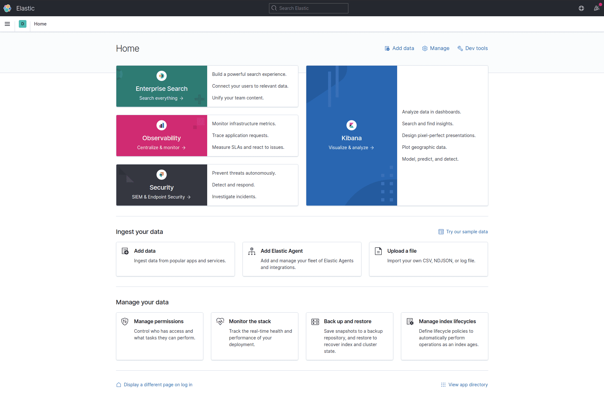
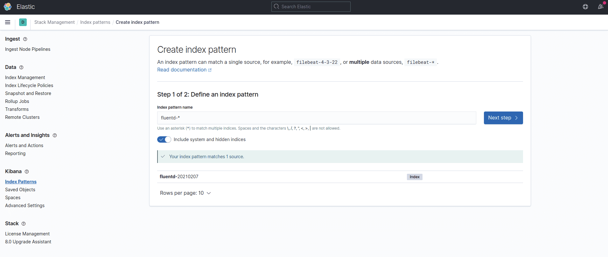
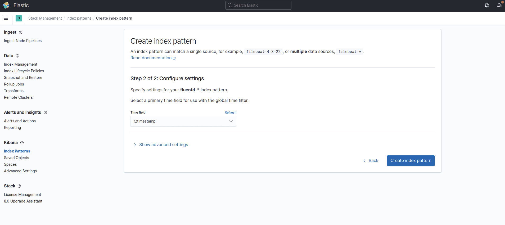
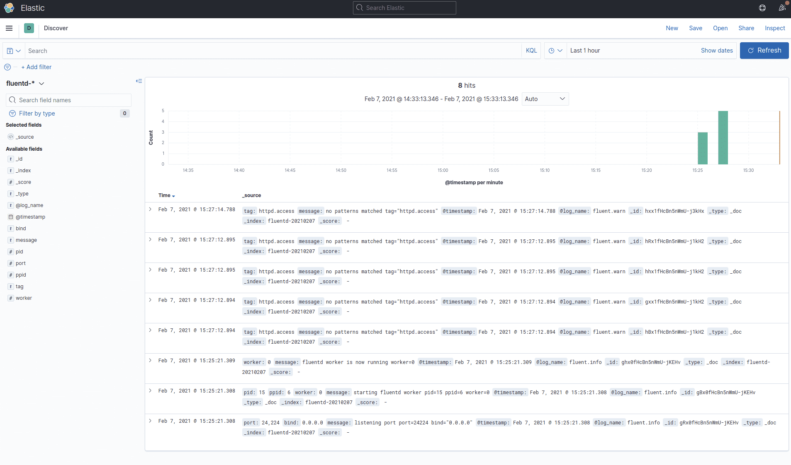

# Docker Compose

This article explains how to collect [Docker](https://www.docker.com/) logs and propagate them to EFK \(Elasticsearch + Fluentd + Kibana\) stack. The example uses [Docker Compose](https://docs.docker.com/compose/) for setting up multiple containers.



[Elasticsearch](https://www.elastic.co/products/elasticsearch) had been an open-source search engine known for its ease of use. [Kibana](https://www.elastic.co/products/kibana) had been an open-source Web UI that makes Elasticsearch user-friendly for marketers, engineers and data scientists alike.

NOTE: Since v7.11, These products are distributed under non open-source license (Dual licensed under Server Side Public License and Elastic License)


By combining these three tools EFK \(Elasticsearch + Fluentd + Kibana\) we get a scalable, flexible, easy to use log collection and analytics pipeline. In this article, we will set up four \(4\) containers, each includes:

* [Apache HTTP Server](https://hub.docker.com/_/httpd/)
* [Fluentd](https://hub.docker.com/r/fluent/fluentd/)
* [Elasticsearch](https://hub.docker.com/_/elasticsearch/)
* [Kibana](https://hub.docker.com/_/kibana/)

All the logs of `httpd` will be ingested into Elasticsearch + Kibana, via Fluentd.

## Prerequisites: Docker

Please download and install Docker / Docker Compose. Well, that's it :\)

* [Docker Installation](https://docs.docker.com/engine/installation/)

## Step 0: Create `docker-compose.yml`

Create `docker-compose.yml` for [Docker Compose](https://docs.docker.com/compose/overview/). Docker Compose is a tool for defining and running multi-container Docker applications.

With the YAML file below, you can create and start all the services \(in this case, Apache, Fluentd, Elasticsearch, Kibana\) by one command:

```text
version: "3"
services:
  web:
    image: httpd
    ports:
      - "80:80"
    links:
      - fluentd
    logging:
      driver: "fluentd"
      options:
        fluentd-address: localhost:24224
        tag: httpd.access

  fluentd:
    build: ./fluentd
    volumes:
      - ./fluentd/conf:/fluentd/etc
    links:
      - "elasticsearch"
    ports:
      - "24224:24224"
      - "24224:24224/udp"

  elasticsearch:
    image: docker.elastic.co/elasticsearch/elasticsearch:7.13.1
    container_name: elasticsearch
    environment:
      - "discovery.type=single-node"
    expose:
      - "9200"
    ports:
      - "9200:9200"

  kibana:
    image: docker.elastic.co/kibana/kibana:7.13.1
    links:
      - "elasticsearch"
    ports:
      - "5601:5601"
```

The `logging` section \(check [Docker Compose documentation](https://docs.docker.com/compose/compose-file/compose-file-v3/#logging)\) of `web` container specifies [Docker Fluentd Logging Driver](https://docs.docker.com/engine/admin/logging/fluentd/) as a default container logging driver. All the logs from the `web` container will automatically be forwarded to `host:port` specified by `fluentd-address`.

## Step 1: Create Fluentd Image with your Config + Plugin

Create `fluentd/Dockerfile` with the following content using the Fluentd [official Docker image](https://hub.docker.com/r/fluent/fluentd/); and then, install the Elasticsearch plugin:

```text
# fluentd/Dockerfile

FROM fluent/fluentd:v1.12.0-debian-1.0
USER root
RUN ["gem", "install", "fluent-plugin-elasticsearch", "--no-document", "--version", "5.0.3"]
USER fluent
```

Then, create the Fluentd configuration file `fluentd/conf/fluent.conf`. The [`forward`](../input/forward.md) input plugin receives logs from the Docker logging driver and `elasticsearch` output plugin forwards these logs to Elasticsearch.

```text
# fluentd/conf/fluent.conf

<source>
  @type forward
  port 24224
  bind 0.0.0.0
</source>

<match *.**>
  @type copy

  <store>
    @type elasticsearch
    host elasticsearch
    port 9200
    logstash_format true
    logstash_prefix fluentd
    logstash_dateformat %Y%m%d
    include_tag_key true
    type_name access_log
    tag_key @log_name
    flush_interval 1s
  </store>

  <store>
    @type stdout
  </store>
</match>
```

NOTE: The detail of used parameters for `@type elasticsearch`, see [Elasticsearch parameters section](../output/elasticsearch.md#parameters) and [fluent-plugin-elasticsearch](https://github.com/uken/fluent-plugin-elasticsearch) furthermore.

## Step 2: Start the Containers

Let's start the containers:

```text
$ docker-compose up --detach
```

Use `docker ps` command to verify that the four \(4\) containers are up and running:

```text
$ docker ps
CONTAINER ID   IMAGE                                                  COMMAND                  CREATED         STATUS         PORTS                                                                                                    NAMES
60a8c3c8fcab   httpd                                                  "httpd-foreground"       6 minutes ago   Up 6 minutes   0.0.0.0:80->80/tcp, :::80->80/tcp                                                                        fluentd-elastic-kibana_web_1
43df4d266636   fluentd-elastic-kibana_fluentd                         "tini -- /bin/entryp…"   6 minutes ago   Up 6 minutes   5140/tcp, 0.0.0.0:24224->24224/tcp, 0.0.0.0:24224->24224/udp, :::24224->24224/tcp, :::24224->24224/udp   fluentd-elastic-kibana_fluentd_1
6a63ad1ddef1   docker.elastic.co/kibana/kibana:7.13.1                 "/bin/tini -- /usr/l…"   6 minutes ago   Up 6 minutes   0.0.0.0:5601->5601/tcp, :::5601->5601/tcp                                                                fluentd-elastic-kibana_kibana_1
6168bd075497   docker.elastic.co/elasticsearch/elasticsearch:7.13.1   "/bin/tini -- /usr/l…"   6 minutes ago   Up 6 minutes   0.0.0.0:9200->9200/tcp, :::9200->9200/tcp, 9300/tcp                                                      elasticsearch
```

## Step 3: Generate `httpd` Access Logs

Use `curl` command to generate some access logs like this:

```text
$ curl http://localhost:80/[1-10]
<html><body><h1>It works!</h1></body></html>
<html><body><h1>It works!</h1></body></html>
<html><body><h1>It works!</h1></body></html>
<html><body><h1>It works!</h1></body></html>
<html><body><h1>It works!</h1></body></html>
<html><body><h1>It works!</h1></body></html>
<html><body><h1>It works!</h1></body></html>
<html><body><h1>It works!</h1></body></html>
<html><body><h1>It works!</h1></body></html>
<html><body><h1>It works!</h1></body></html>
```

## Step 4: Confirm Logs from Kibana

Browse to `http://localhost:5601/app/management/kibana/indexPatterns` and set up the index name pattern for Kibana. Specify `fluentd-*` to `Index name or pattern` and click `Create`.

 

Then, go to `Discover` tab to check the logs. As you can see, logs are properly collected into the Elasticsearch + Kibana, via Fluentd.



## Code

The code is available at [https://github.com/digikin/fluentd-elastic-kibana](https://github.com/digikin/fluentd-elastic-kibana).

## Learn More

* [Fluentd: Architecture](https://www.fluentd.org/architecture)
* [Fluentd: Get Started](../quickstart/)
* [Downloading Fluentd](http://www.fluentd.org/download)

If this article is incorrect or outdated, or omits critical information, please [let us know](https://github.com/fluent/fluentd-docs-gitbook/issues?state=open). [Fluentd](http://www.fluentd.org/) is an open-source project under [Cloud Native Computing Foundation \(CNCF\)](https://cncf.io/). All components are available under the Apache 2 License.

