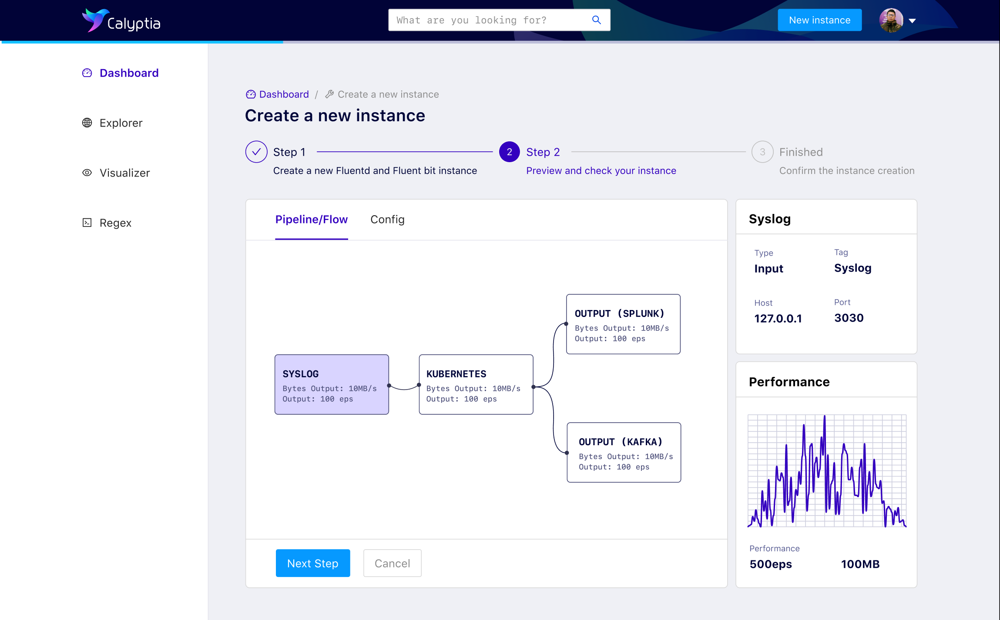

# Fluentd UI

[fluentd-ui](https://github.com/fluent/fluentd-ui) is a browser-based [fluentd](http://fluentd.org/) and [td-agent](https://docs.treasuredata.com/display/public/PD/About+Treasure+Data%27s+Server-Side+Agent) manager that supports the following operations:

* Install, uninstall, and upgrade Fluentd plugins
* Start/stop/restart fluentd process
* Configure Fluentd settings such as config file, pid file path, etc.
* View Fluentd log with simple error viewer

`fluentd-ui` does not work with `fluentd` v1 and `td-agent` 3 and 4 do not include it. This content is for v0.12 for now.

## Enterprise

[Calyptia](https://www.calyptia.com), from [fluentd.org/enterprise](https://www.fluentd.org/enterprise), offers an enterprise UI on top of Fluentd and Fluent Bit. Please visit their site for more information



## Getting Started

For `td-agent`, you can start it by `td-agent-ui start` like this:

```text
$ sudo /usr/sbin/td-agent-ui start
Puma 2.9.2 starting...
* Min threads: 0, max threads: 16
* Environment: production
* Listening on tcp://0.0.0.0:9292
```

For `fluentd` gem installation, install `fluentd-ui` via `gem` command:

```text
$ gem install -V fluentd-ui
$ fluentd-ui start
Puma 2.9.2 starting...
* Min threads: 0, max threads: 16
* Environment: production
* Listening on tcp://0.0.0.0:9292
```

Then, open [http://localhost:9292/](http://localhost:9292/) in your browser.

The default account credentials are:

* `username="admin"`
* `password="changeme"`


## Screenshots

\(v0.3.9\)

### Dashboard


### Setting


### `in_tail` setting


### Plugin


If this article is incorrect or outdated, or omits critical information, please [let us know](https://github.com/fluent/fluentd-docs-gitbook/issues?state=open). [Fluentd](http://www.fluentd.org/) is an open-source project under [Cloud Native Computing Foundation \(CNCF\)](https://cncf.io/). All components are available under the Apache 2 License.

