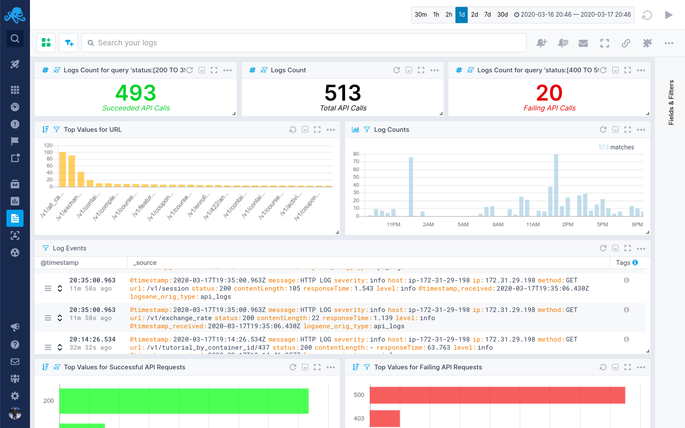
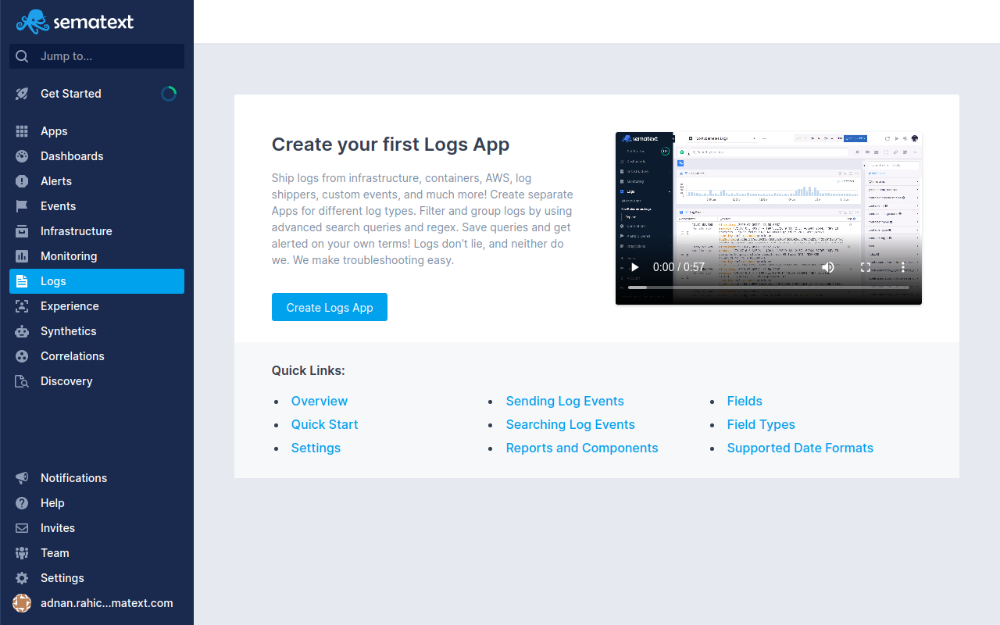

# Send Syslog Data to Sematext

[Sematext](https://sematext.com/) is a tool for managing logs, and considered an alternative to Splunk, but with cheaper and more flexible [pricing](https://sematext.com/pricing). In this article, we present an alternative to Splunk by combining Fluentd with the Sematext open Elasticsearch API.



[Elasticsearch](https://www.elastic.co/products/elasticsearch) is an open source search engine known for its ease of use. [Sematext](https://sematext.com/) runs and manages Elasticsearch in the cloud. You also have the option to use [Kibana](https://www.elastic.co/products/kibana) alongside the dashboards in the Sematext UI.

By combining Fluentd and Sematext's managed Elasticsearch + Kibana you get a scalable, flexible, easy to use log management tool and search engine with an intuitive native web UI. You also get Kibana, if you want to use it. This provides a managed Splunk alternative, for a fraction of the cost.

In this guide, we'll cover the installation, setup, and basic use of this log management solution. This setup was tested on Ubuntu 18.04. **If you're not familiar with Fluentd**, please learn more about Fluentd first.

## Prerequisites

### Set Up Sematext

You need to [sign up](https://apps.sematext.com/ui/registration) and create an App. Read more in the docs [here](https://sematext.com/docs/).

### Set Up Fluentd \(`td-agent`\)

In this guide you'll install `td-agent`, the stable release of Fluentd. Please refer to the guides below for detailed installation steps:

* [Debian Package](../installation/install-by-deb.md)
* [RPM Package](../installation/install-by-rpm.md)
* [Ruby gem](../installation/install-by-gem.md)

Next, install the Elasticsearch plugin for Fluentd `fluent-plugin-elasticsearch`:

```text
$ sudo /usr/sbin/td-agent-gem install fluent-plugin-elasticsearch --no-document
```

Now you'll configure the `td-agent` \(Fluentd\) to interface properly with Elasticsearch. Please edit `/etc/td-agent/td-agent.conf` as shown below:

```text
# Switch to debug if you need to debug
<system>
  log_level debug
</system>

# get logs from syslog
<source>
  @type syslog
  port 42185
  tag syslog
</source>

# get logs from fluent-logger, fluent-cat or other Fluentd instances
<source>
  @type forward
</source>

<filter **>
  @type stdout
</filter>

<match syslog.**>
  @type elasticsearch
  host logsene-receiver.sematext.com
  # for EU
  # host logsene-receiver.eu.sematext.com
  port 443
  scheme https
  index_name <LOGS_TOKEN>
  <buffer>
    @type file
    path /tmp/fluent/es-buffer/es.all.*.buffer
    chunk_limit_size 250k
    flush_interval 50s
    flush_thread_count 1
    retry_limit 5
    retry_wait 60
  </buffer>
</match>
```

Once everything has been set up and configured, start `td-agent`:

```text
# init
$ sudo /etc/init.d/td-agent start

# or systemd
$ sudo systemctl start td-agent.service
```

## Set Up `rsyslogd`

Finally, configure forwarding logs from your `rsyslogd` to Fluentd. Please add the following line to your `/etc/rsyslog.conf`, and restart `rsyslog`. This will forward your local syslog to Fluentd, and Fluentd will forward the logs to Sematext:

```text
*.* @127.0.0.1:42185
```

Please restart the `rsyslog` service once the modification is complete:

```text
$ sudo /etc/init.d/rsyslog restart
```

## Store and Search Logs

Once Fluentd receives logs from `rsyslog` and ships them to Sematext, you can view, search and visualize the log data using prebuilt Dashboards, by creating custom Dashboards, or with Kibana.

First of all, open up the Seamtext UI and access your App. You'll see prebuilt dashboards with full-text search, filters, and alerts out-of-the-box.



Sematext will automatically figure out hosts, idents, pids, timestamps, and the origin of the logs. In this case the origin is Fluentd.

After you start receiving logs, you can create custom charts, reports, and alerts to fine-tune your own personal use-case.

If you are used to Kibana, you can still use it as well. For more details, read [Kibana's official manual](https://www.elastic.co/guide/en/kibana/current/index.html).


### Debugging

To manually send logs to Sematext, please use the `logger` command:

```text
$ logger -t test foobar
```

When debugging your `td-agent` configuration, using [`filter_stdout`](../filter/stdout.md) will be useful. All the logs including errors can be found at `/etc/td-agent/td-agent.log`.

```text
<filter **>
  @type stdout
</filter>

<match **>
  @type elasticsearch
  host logsene-receiver.sematext.com
  # for EU
  # host logsene-receiver.eu.sematext.com
  port 443
  scheme https
  index_name <LOGS_TOKEN>
  <buffer>
    flush_interval 5s # for testing
  </buffer>
</match>
```

## Conclusion

This how-to guide introduced an alternative SaaS tool to use instead of Splunk. The combination of Fluentd and Sematext, with an open Elasticsearch API and Kibana, gives you tooling you are used to, with the added benefit of not having to manage an Elasticsearch cluster.

You'll get access to storing and searching logs from infrastructure, apps, and software. The example provided in this article has been tested for the current production environments of Sematext.

## Learn More

* [Fluentd Architecture](https://www.fluentd.org/architecture)
* [Fluentd Get Started](../quickstart/)
* [Downloading Fluentd](http://www.fluentd.org/download)
* [Set up Fluentd with Sematext](https://apps.sematext.com/ui/howto/Logsene/fluentd?activeSection=fluentd)

If this article is incorrect or outdated, or omits critical information, please [let us know](https://github.com/fluent/fluentd-docs-gitbook/issues?state=open). [Fluentd](http://www.fluentd.org/) is an open-source project under [Cloud Native Computing Foundation \(CNCF\)](https://cncf.io/). All components are available under the Apache 2 License.

