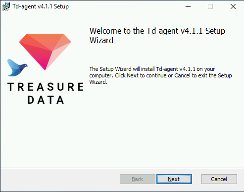
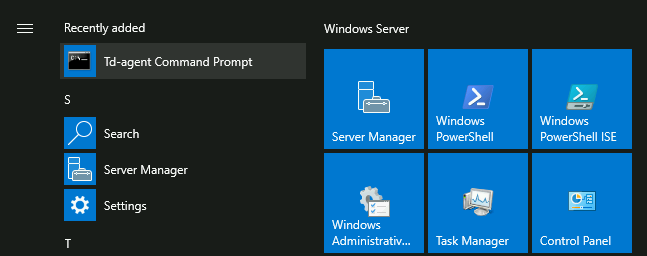
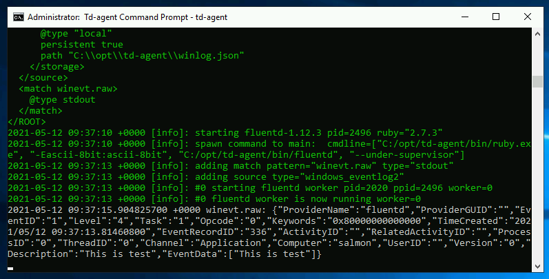

# Install by .msi Installer \(Windows\)

The recommended way to install Fluentd on Windows is to use MSI installers of `td-agent`.

## What is `td-agent`?

`td-agent` is a packaged distribution of Fluentd.

* Includes Ruby and other library dependencies \(since most Windows machines don't have them installed\).
* Includes a set of commonly-used 3rd-party plugins such as `out_es`.
* Originally developed by [Treasure Data, Inc](http://www.treasuredata.com/) \(hence the name\).

Currently two versions of `td-agent` are available.

* `td-agent` v4 packages Fluentd 1.11.x \(or later\). This version is recommended.
* `td-agent` v3 packages Fluentd 1.10.x \(or below\).

NOTE: About deprecated [Treasure Agent (td-agent) 3 will not be maintained anymore](https://www.fluentd.org/blog/schedule-for-td-agent-3-eol), see [Install by msi Package  v3](install-by-msi-td-agent-v3.md).

## Step 1: Install `td-agent`

Download the latest MSI installer from [the download page](https://td-agent-package-browser.herokuapp.com/4/windows). Run the installer and follow the wizard.



Alternatively `td-agent` can be installed with [winget](https://www.microsoft.com/en-us/p/app-installer/9nblggh4nns1):

```text
> winget install td-agent
```

## Step 2: Set up `td-agent.conf`

Open `C:/opt/td-agent/etc/td-agent/td-agent.conf` with a text editor. Replace the configuration with the following content:

```text
<source>
  @type windows_eventlog2
  @id windows_eventlog2
  channels application
  read_existing_events false
  tag winevt.raw
  rate_limit 200
  <storage>
    @type local
    persistent true
    path C:\opt\td-agent\winlog.json
  </storage>
</source>

<match winevt.raw>
  @type stdout
</match>
```

## Step 3: Launch Td-agent Command Prompt

Open Windows Start menu, and search `Td-agent Command Prompt`. In most environments, the program will be found right under the "Recently Added" section.



`Td-agent Command Prompt` is basically `cmd.exe`, with a few PATH tweaks for `td-agent` programs. Use this program whenever you need to interact with `td-agent`.

## Step 4: Run `td-agent`

Type the following command into `Td-agent Command Prompt`:

```text
C:\opt\td-agent> td-agent
```

Now `td-agent` starts listening to Windows Eventlog, and will print records to stdout as they occur.



## Step 5: Run `td-agent` as Windows service

Since version 4.0.0, `td-agent` is registered as a Windows service permanently by the msi installer. You can start `td-agent` service manually.

### Using GUI

Please guide yourself to `Control Panel -> System and Security -> Administrative Tools -> Services`, and you'll see `Fluentd Windows Service` is listed.

Please double click `Fluentd Window Service`, and click `Start` button. Then the process will be executed as Windows Service.

### Using `net.exe`

```text
> net start fluentdwinsvc
The Fluentd Windows Service service is starting..
The Fluentd Windows Service service was started successfully.
```

### Using Powershell Cmdlet

```text
PS> Start-Service fluentdwinsvc
```

Note that using `fluentdwinsvc` is needed to start Fluentd service from the command-line. `fluentdwinsvc` is the service name and it should be passed to `net.exe` or `Start-Service` Cmdlet.

The log file will be located at `C:/opt/td-agent/td-agent.log` as we specified in Step 3.

## Step 6: Install Plugins

Open `Td-agent Command Prompt` and use `td-agent-gem` command:

```text
C:\opt\td-agent> td-agent-gem install fluent-plugin-xyz --version=1.2.3
```

## Next Steps

You are now ready to collect real logs with Fluentd. Refer to the following tutorials on how to collect data from various sources:

* Basic Configuration
  * [Config File](../configuration/config-file.md)
* Application Logs
  * [Ruby](../language-bindings/ruby.md)
  * [Java](../language-bindings/java.md)
  * [Python](../language-bindings/python.md)
  * [PHP](../language-bindings/php.md)
  * [Perl](../language-bindings/perl.md)
  * [Node.js](../language-bindings/nodejs.md)
  * [Scala](../language-bindings/scala.md)
* Examples
  * [Store Apache Log into Amazon S3](../how-to-guides/apache-to-s3.md)
  * [Store Apache Log into MongoDB](../how-to-guides/apache-to-mongodb.md)
  * [Data Collection into HDFS](../how-to-guides/http-to-hdfs.md)

For further steps, follow these:

* [ChangeLog of td-agent](https://docs.treasuredata.com/display/public/PD/The+td-agent+Change+Log)
* [Chef Cookbook](https://github.com/treasure-data/chef-td-agent/)

If this article is incorrect or outdated, or omits critical information, please [let us know](https://github.com/fluent/fluentd-docs-gitbook/issues?state=open). [Fluentd](http://www.fluentd.org/) is an open-source project under [Cloud Native Computing Foundation \(CNCF\)](https://cncf.io/). All components are available under the Apache 2 License.

