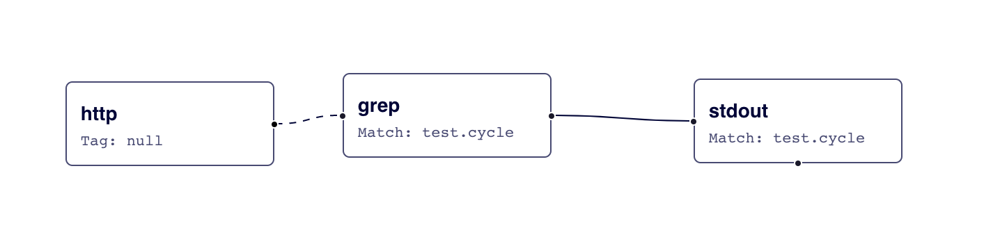
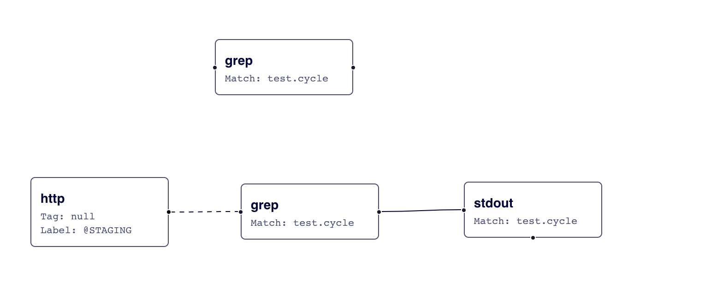

# Life of a Fluentd event

The following article gives a general overview of how events are processed by [Fluentd](http://fluentd.org) with examples. It covers the complete lifecycle including **Setup**, **Inputs**, **Filters**, **Matches** and **Labels**.

## Basic Setup

The configuration file is the fundamental piece to connect all things together, as it allows to define which **Inputs** or listeners [Fluentd](http://fluentd.org) will have and set up common matching rules to route the **Event** data to a specific **Output**.

We will use the [`in_http`](../input/http.md) and the [`out_stdout`](../output/stdout.md) plugins as examples to describe the events cycle. The following is a basic definition on the configuration file to specify an `http` input, for short: we will be listening for **HTTP Requests**:

```text
<source>
  @type http
  port 8888
  bind 0.0.0.0
</source>
```

The definition specifies that an HTTP server will be listening on TCP port `8888`.

Now, let's define a **Matching** rule to print the incoming requests to the standard output:

```text
<match test.cycle>
  @type stdout
</match>
```

The **Match** sets a rule where each **Incoming** event that arrives with a **Tag** equals to `test.cycle`, will match and use the **Output** plugin type called `stdout`. At this point we have an **Input** type, a _Match_ and an **Output**.

Let's test this setup using `curl`:

```text
$ curl -i -X POST -d 'json={"action":"login","user":2}' http://localhost:8888/test.cycle
HTTP/1.1 200 OK
Content-type: text/plain
Connection: Keep-Alive
Content-length: 0
```

The Fluentd logs should look like this:

```text
$ fluentd -c in_http.conf
2019-12-16 18:58:15 +0900 [info]: parsing config file is succeeded path="in_http.conf"
2019-12-16 18:58:15 +0900 [info]: gem 'fluentd' version '1.8.0'
2019-12-16 18:58:15 +0900 [info]: using configuration file: <ROOT>
  <source>
    @type http
    port 8888
    bind "0.0.0.0"
  </source>
  <match test.cycle>
    @type stdout
  </match>
</ROOT>
2019-12-16 18:58:15 +0900 [info]: starting fluentd-1.8.0 pid=44323 ruby="2.4.6"
2019-12-16 18:58:15 +0900 [info]: spawn command to main:  cmdline=["/path/to/ruby", "-Eascii-8bit:ascii-8bit", "/path/to/fluentd", "-c", "in_http.conf", "--under-supervisor"]
2019-12-16 18:58:16 +0900 [info]: adding match pattern="test.cycle" type="stdout"
2019-12-16 18:58:16 +0900 [info]: adding source type="http"
2019-12-16 18:58:16 +0900 [info]: #0 starting fluentd worker pid=44336 ppid=44323 worker=0
2019-12-16 18:58:16 +0900 [info]: #0 fluentd worker is now running worker=0
2019-12-16 18:58:27.888557000 +0900 test.cycle: {"action":"login","user":2}
```

## Event Structure

A Fluentd event consists of three components:

* `tag`: Specifies the origin where an event comes from. It is used for

  message routing.

* `time`: Specifies the time when an event happens with nanosecond resolution.
* `record`: Specifies the actual log as a JSON object.

The input plugin is responsible for generating the Fluentd event from data sources. For example, `in_tail` generates events from text lines. If you have the following Apache log:

```text
192.168.0.1 - - [28/Feb/2013:12:00:00 +0900] "GET / HTTP/1.1" 200 777
```

You get the following Fluentd event:

```text
tag: apache.access         # set by configuration
time: 1362020400.000000000 # 28/Feb/2013:12:00:00 +0900
record: {"user":"-","method":"GET","code":200,"size":777,"host":"192.168.0.1","path":"/"}
```

## Processing Events

When a **Setup** is defined, the **Router Engine** contains several predefined rules to apply to different input data. Internally, an **Event** will to pass through a chain of procedures that may alter its lifecycle.

Now, we will expand on our previous basic example and we will add more steps in our **Setup** to demonstrate how the **Events** cycle can be altered. We will do this through the new **Filters** implementation.

### Filters

A **Filter** behaves like a rule to pass or reject an event. The following configuration adds a **Filter** definition:

```text
<source>
  @type http
  port 8888
  bind 0.0.0.0
</source>

<filter test.cycle>
  @type grep
  <exclude>
    key action
    pattern ^logout$
  </exclude>
</filter>

<match test.cycle>
  @type stdout
</match>
```

Fluentd configuration visualization link: [https://link.calyptia.com/gjl](https://link.calyptia.com/gjl) \(sign-up required\)



As you can see, the new **Filter** definition will be a mandatory step to pass before the control goes to the **Match** section. The **Filter** basically will accept or reject the **Event** based on its `type` and rule. For our example we want to discard any user **logout** action. We only care about the **logins**. The way to accomplish this, is doing a `grep` inside the **Filter** to exclude any message on which `action` key have the **logout** string.

From a terminal, run the following two `curl` commands containing different `action` values:

```text
$ curl -i -X POST -d 'json={"action":"login","user":2}' http://localhost:8888/test.cycle
HTTP/1.1 200 OK
Content-type: text/plain
Connection: Keep-Alive
Content-length: 0

$ curl -i -X POST -d 'json={"action":"logout","user":2}' http://localhost:8888/test.cycle
HTTP/1.1 200 OK
Content-type: text/plain
Connection: Keep-Alive
Content-length: 0
```

Fluentd logs show only one `login` message. The `logout` event has been discarded:

```text
$ fluentd -c in_http.conf
2019-12-16 19:07:39 +0900 [info]: parsing config file is succeeded path="in_http.conf"
2019-12-16 19:07:39 +0900 [info]: gem 'fluentd' version '1.8.0'
2019-12-16 19:07:39 +0900 [info]: using configuration file: <ROOT>
  <source>
    @type http
    port 8888
    bind "0.0.0.0"
  </source>
  <filter test.cycle>
    @type grep
    <exclude>
      key "action"
      pattern ^logout$
    </exclude>
  </filter>
  <match test.cycle>
    @type stdout
  </match>
</ROOT>
2019-12-16 19:07:39 +0900 [info]: starting fluentd-1.8.0 pid=44435 ruby="2.4.6"
2019-12-16 19:07:39 +0900 [info]: spawn command to main:  cmdline=["/path/to/ruby", "-Eascii-8bit:ascii-8bit", "/path/to/fluentd", "-c", "in_http.conf", "--under-supervisor"]
2019-12-16 19:07:40 +0900 [info]: adding filter pattern="test.cycle" type="grep"
2019-12-16 19:07:40 +0900 [info]: adding match pattern="test.cycle" type="stdout"
2019-12-16 19:07:40 +0900 [info]: adding source type="http"
2019-12-16 19:07:40 +0900 [info]: #0 starting fluentd worker pid=44448 ppid=44435 worker=0
2019-12-16 19:07:40 +0900 [info]: #0 fluentd worker is now running worker = 0
2019-12-16 19:08:06.934660000 +0900 test.cycle: {"action":"login","user":2}
```

As you can see, the **Events** follow a _step-by-step cycle_ where they are processed in order, from top-to-bottom. The new engine allows to integrate many **Filters** as required. Also, considering that the configuration file may grow and start getting a bit complex for the readers, a new feature called **Labels** has been introduced to solve this potential problem.

### Labels

This new implementation called **Labels**, aims to solve the configuration file complexity and allows to define new **Routing** sections that do not follow the top-to-bottom order, instead they act like linked references. Taking the previous example, we will modify the setup as follows:

```text
<source>
  @type http
  bind 0.0.0.0
  port 8888
  @label @STAGING
</source>

<filter test.cycle>
  @type grep
  <exclude>
    key action
    pattern ^login$
  </exclude>
</filter>

<label @STAGING>
  <filter test.cycle>
    @type grep
    <exclude>
      key action
      pattern ^logout$
    </exclude>
  </filter>

  <match test.cycle>
    @type stdout
  </match>
</label>
```

Fluentd configuration visualization: [https://link.calyptia.com/guh](https://link.calyptia.com/guh) \(sign-up required\)



The new configuration contains a `@label` parameter under `source` indicating that the further steps will take place on the `@STAGING` label section. The expectation is that every event reported on the **Source**, the **Routing Engine** will continue processing on `@STAGING`. Hence, it will skip the old filter definition.

### Buffers

In this example, we use `stdout`, the non-buffered output. But in production, you use outputs in buffered mode e.g. `forward`, `mongodb`, `s3` and etc. An output plugin using buffered mode first stores the received events into buffers and then writes out buffers to a destination after meeting flush conditions. So, using the buffered output, you do not see the received events immediately unlike `stdout` non-buffered output.

Buffer is important for reliability and throughput. See [Output](../output/) and [Buffer](../buffer/) articles.

## Conclusion

Once the events are reported by the [Fluentd](http://fluend.org) engine on the **Source**, they are processed step-by-step or inside a referenced **Label**. Any **Event** may be filtered out at any moment. The new **Routing Engine** behavior provides more flexibility and makes easier the processing before reaching the **Output** plugin.

## Learn More

* [Fluentd v0.12 Blog Announcement](http://www.fluentd.org/blog/fluentd-v0.12-is-released)
* [Fluentd v0.14 Blog Announcement](http://www.fluentd.org/blog/fluentd-v0.14.0-has-been-released)
* [Fluentd v1.0 Blog Announcement](http://www.fluentd.org/blog/fluentd-v1.0)

If this article is incorrect or outdated, or omits critical information, please [let us know](https://github.com/fluent/fluentd-docs-gitbook/issues?state=open). [Fluentd](http://www.fluentd.org/) is an open-source project under [Cloud Native Computing Foundation \(CNCF\)](https://cncf.io/). All components are available under [the Apache License 2.0.](https://www.apache.org/licenses/LICENSE-2.0)

