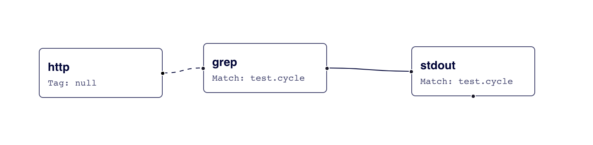
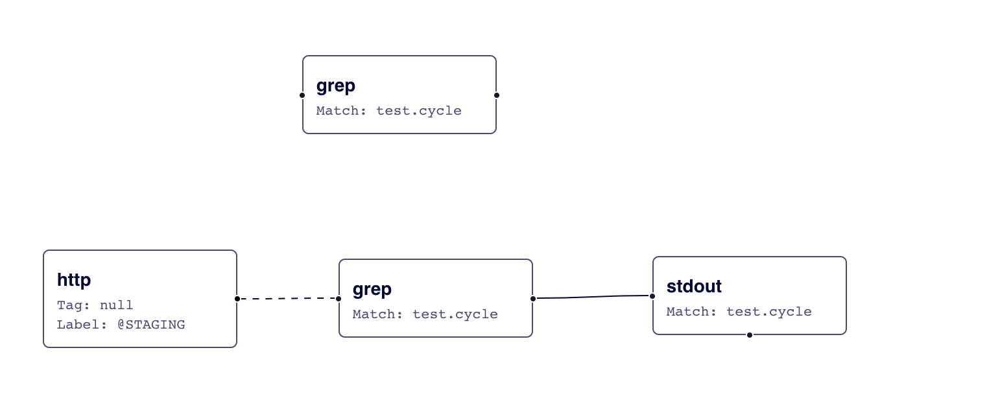

# Life of a Fluentd event

* goal
  * how events are processed -- by -- Fluentd
    * events lifecycle
      * **Setup**,
      * **Inputs**,
      * **Filters**,
      * **Matches**
      * **Labels**

## Basic Setup

* configuration file
  * ⚠️required by Fluentd⚠️
  * types
    * [common](../configuration/config-file.md)
    * [.yaml](../configuration/config-file-yaml.md)
  * allows
    * controlling Fluentd's behavior input -- output, by setting up
      * **Inputs** or listeners
        * == -- via -- input & output plugins
      * matching rules / **Event** data is routed -- to a -- specific **Output**
        * == -- via -- plugin parameters

* _Example:_ TODO: set up the example
  * [`in_http`](../input/http.md) plugins
    * == listen for HTTP Requests
  * [`out_stdout`](../output/stdout.md) plugins
 
    ```text, title=configurationFile
    <source>
      @type http        // -- for -- `http` input 
      port 8888         // HTTP server will be listening | TCP port `8888` 
      bind 0.0.0.0
    </source>
    ```

    ```text, title=matchingRule
    <match test.cycle>      // rule: incoming rule / tag == test.cycle 
      @type stdout          // incoming requests are printed | standard output 
    </match>
    ```

  * if you want to test -> use `curl`

    ```text
    $ curl -i -X POST -d 'json={"action":"login","user":2}' http://localhost:8888/test.cycle
    HTTP/1.1 200 OK
    Content-type: text/plain
    Connection: Keep-Alive
    Content-length: 0
    ```
  * Fluentd's logs

    ```text
    $ fluentd -c in_http.conf
    2019-12-16 18:58:15 +0900 [info]: parsing config file is succeeded path="in_http.conf"
    2019-12-16 18:58:15 +0900 [info]: gem 'fluentd' version '1.8.0'
    2019-12-16 18:58:15 +0900 [info]: using configuration file: <ROOT>
      <source>
        @type http
        port 8888
        bind "0.0.0.0"
      </source>
      <match test.cycle>
        @type stdout
      </match>
    </ROOT>
    2019-12-16 18:58:15 +0900 [info]: starting fluentd-1.8.0 pid=44323 ruby="2.4.6"
    2019-12-16 18:58:15 +0900 [info]: spawn command to main:  cmdline=["/path/to/ruby", "-Eascii-8bit:ascii-8bit", "/path/to/fluentd", "-c", "in_http.conf", "--under-supervisor"]
    2019-12-16 18:58:16 +0900 [info]: adding match pattern="test.cycle" type="stdout"
    2019-12-16 18:58:16 +0900 [info]: adding source type="http"
    2019-12-16 18:58:16 +0900 [info]: #0 starting fluentd worker pid=44336 ppid=44323 worker=0
    2019-12-16 18:58:16 +0900 [info]: #0 fluentd worker is now running worker=0
    2019-12-16 18:58:27.888557000 +0900 test.cycle: {"action":"login","user":2}
    ```

## Event Structure

* Fluentd's event ==
  * `tag`
    * == origin | event comes from
    * uses
      * route messages 
  * `time`
    * == time | event happens / nanosecond resolution
  * `record`
    * == actual log -- as a -- JSON object

* input plugin
  * responsible for
    * FROM data sources, generate -- the -- Fluentd event 
      * _Example:_ `in_tail`: FROM text lines, generate events

        ```text
        192.168.0.1 - - [28/Feb/2013:12:00:00 +0900] "GET / HTTP/1.1" 200 777
        ```
        Fluent event
        ```text
        tag: apache.access         # set by configuration
        time: 1362020400.000000000 # 28/Feb/2013:12:00:00 +0900
        record: {"user":"-","method":"GET","code":200,"size":777,"host":"192.168.0.1","path":"/"}
        ```

## Processing Events

* in order
  * == from top-to-bottom
* AFTER defining a **Setup**
  * **Router Engine**
    * 's predefined rules
      * apply | SEVERAL input data

### Filters

* ' behavior
  * == rule's behavior
    * pass an event OR 
    * reject an event

* _Example:_ ONLY show 1 `login` message -- TODO: set up the example

    ```text, title=configurationFile
    <source>
      @type http
      port 8888
      bind 0.0.0.0
    </source>
    
    // BEFORE match rule
    <filter test.cycle>
      @type grep            // based on type
      <exclude>             // reject user **logout** action
        key action
        pattern ^logout$
      </exclude>
    </filter>
    
    <match test.cycle>
      @type stdout
    </match>
    ```

    

    if you want to test -> use `curl`

    ```text
    $ curl -i -X POST -d 'json={"action":"login","user":2}' http://localhost:8888/test.cycle
    HTTP/1.1 200 OK
    Content-type: text/plain
    Connection: Keep-Alive
    Content-length: 0
    
    $ curl -i -X POST -d 'json={"action":"logout","user":2}' http://localhost:8888/test.cycle
    HTTP/1.1 200 OK
    Content-type: text/plain
    Connection: Keep-Alive
    Content-length: 0
    ```

    `logout` event has been discarded:

    ```text
    $ fluentd -c in_http.conf
    2019-12-16 19:07:39 +0900 [info]: parsing config file is succeeded path="in_http.conf"
    2019-12-16 19:07:39 +0900 [info]: gem 'fluentd' version '1.8.0'
    2019-12-16 19:07:39 +0900 [info]: using configuration file: <ROOT>
      <source>
        @type http
        port 8888
        bind "0.0.0.0"
      </source>
      <filter test.cycle>
        @type grep
        <exclude>
          key "action"
          pattern ^logout$
        </exclude>
      </filter>
      <match test.cycle>
        @type stdout
      </match>
    </ROOT>
    2019-12-16 19:07:39 +0900 [info]: starting fluentd-1.8.0 pid=44435 ruby="2.4.6"
    2019-12-16 19:07:39 +0900 [info]: spawn command to main:  cmdline=["/path/to/ruby", "-Eascii-8bit:ascii-8bit", "/path/to/fluentd", "-c", "in_http.conf", "--under-supervisor"]
    2019-12-16 19:07:40 +0900 [info]: adding filter pattern="test.cycle" type="grep"
    2019-12-16 19:07:40 +0900 [info]: adding match pattern="test.cycle" type="stdout"
    2019-12-16 19:07:40 +0900 [info]: adding source type="http"
    2019-12-16 19:07:40 +0900 [info]: #0 starting fluentd worker pid=44448 ppid=44435 worker=0
    2019-12-16 19:07:40 +0900 [info]: #0 fluentd worker is now running worker = 0
    2019-12-16 19:08:06.934660000 +0900 test.cycle: {"action":"login","user":2}
    ```

### Labels

* uses
  * reduce the configuration file complexity
* allows
  * define NEW **Routing** sections /
    * NOT follow the top-to-bottom order
    * == linked references

* _Example:_

    ```text, title=configurationFile
    <source>
      @type http
      bind 0.0.0.0
      port 8888
      @label @STAGING
    </source>
    
    <filter test.cycle>
      @type grep
      <exclude>
        key action
        pattern ^login$
      </exclude>
    </filter>
    
    <label @STAGING>             // | @STAGING, **Routing Engine** keep on processing the events / reported | **Source**
      <filter test.cycle>
        @type grep
        <exclude>
          key action
          pattern ^logout$
        </exclude>
      </filter>
    
      <match test.cycle>
        @type stdout
      </match>
    </label>
    ```

    

### Buffers

* Buffer
  * allows
    * reliability
    * throughput
  * see [Buffer](../buffer/)

* `stdout`
  * == non-buffered output
  * use cases
    * non production

* `forward`, `mongodb`, `s3`
  * == buffered outputs
    * how does it work?
      * stores the received events | buffers
      * AFTER meeting flush conditions, writes out buffers | destination after
    * you do NOT see the received events IMMEDIATELY
  * use cases
    * production

## Conclusion

* | events are reported by the Fluentd engine | **Source**,
  * events
    * are processed
      * step-by-step OR
      * | referenced **Label**
    * can be filtered out | ANY moment

* **Routing Engine** 
  * enables
    * MORE flexibility
    * easier processing, BEFORE reaching the **Output** plugin
